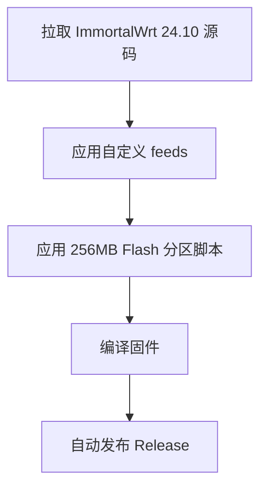

## 项目简介

[blog](https://blog.rax.pp.ua/posts/%E4%BA%91%E7%BC%96%E8%AF%91-256m%E9%97%AA%E5%AD%98%E7%9A%84360t7%E8%B7%AF%E7%94%B1%E5%99%A8immoralwrt%E5%9B%BA%E4%BB%B6/)

### 本项目用于为 奇虎 360T7（MT7981） 路由器编译定制版 ImmortalWrt 24.10 固件，适用于：

- 已扩容至 512MB RAM
- 已扩容至 256MB SPI-NAND Flash
- 需要大容量 UBI Overlay
- 通过 GitHub Actions 自动云编译
- 本固件在原官方 DTS 基础上调整分区，使 UBI 分区扩展至 256MB Flash 可用空间。

### 主要特性

- 基于 ImmortalWrt 官方源码 openwrt-24.10
- 适配 360T7 (MT7981 Filogic)
- 修改 DTS 分区：
- UBI 分区扩大
- 预留 config / factory / log 分区

### 默认启用：

- LuCI
- nginx
- IPv6
- PPPoE
- dnsmasq-full

###  分区说明（256MB Flash 方案）
原版 128MB Flash 结构：

```
| uboot | kernel | rootfs | ubi | config | factory | log |
```

扩容后思路：

> 保持前半部分结构不变  
> 在原 128MB 基础上整体向后扩展 128MB  
> 扩大 UBI 分区容量

### 编译方式

本项目使用 GitHub Actions 云编译。GitHub Actions 自动编译并发布 Release。

触发方式：

Actions → Run workflow

### 编译流程：



### 目录结构说明
```
.github/workflows/
    openwrt-builder.yml   ### 云编译流程

.config                    ### 固件配置文件
diy-part1.sh               ### feeds 自定义
diy-part2.sh               ### 自定义补丁
diy-360t7-flash256.sh      ### 256MB Flash 分区脚本
```

### Thinks P3TERX Actions-OpenWrt
### License
本项目基于 ImmortalWrt / OpenWrt，遵循 GPL 协议。
[MIT](https://github.com/P3TERX/Actions-OpenWrt/blob/main/LICENSE) © [**P3TERX**](https://p3terx.com)
